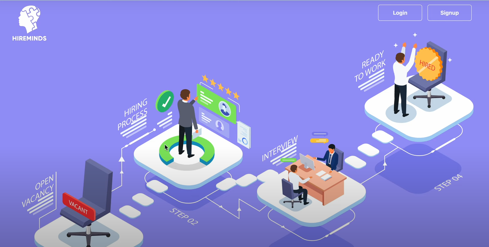
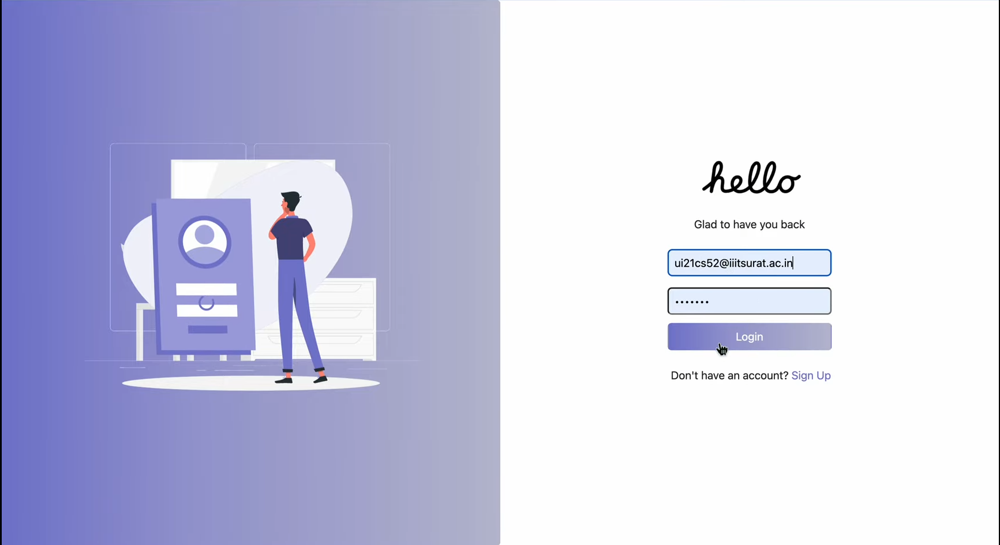
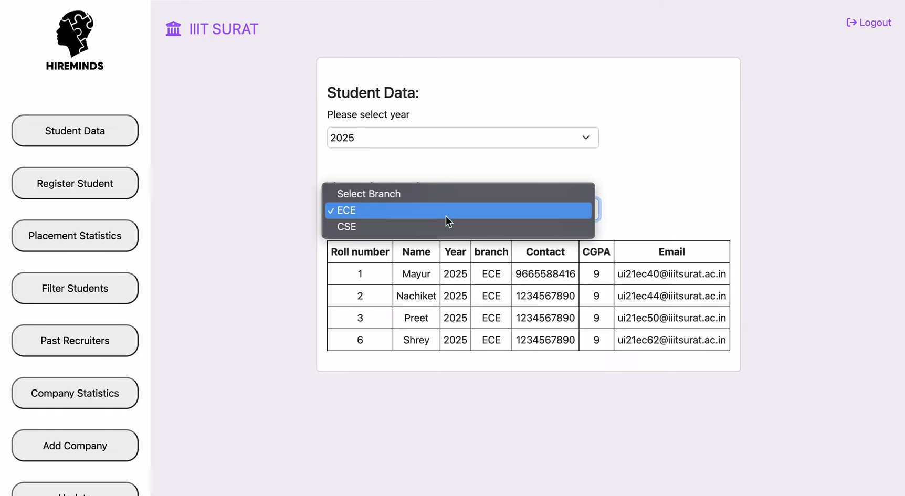
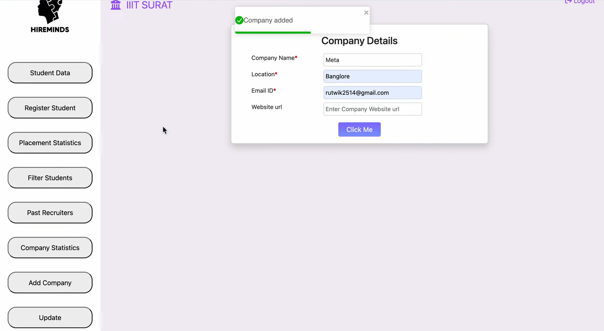
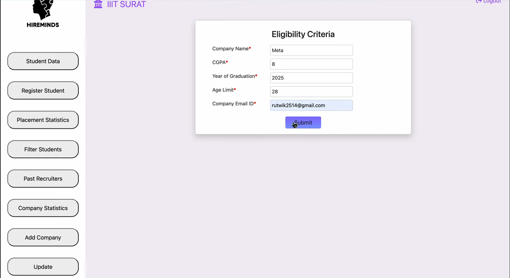
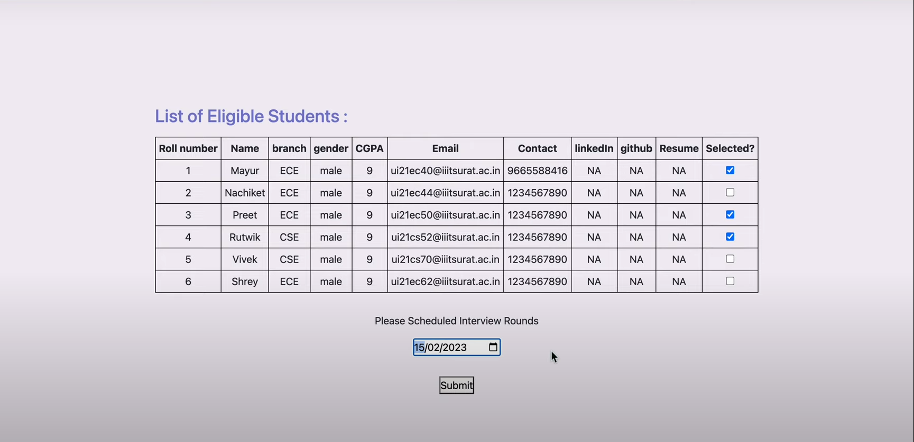
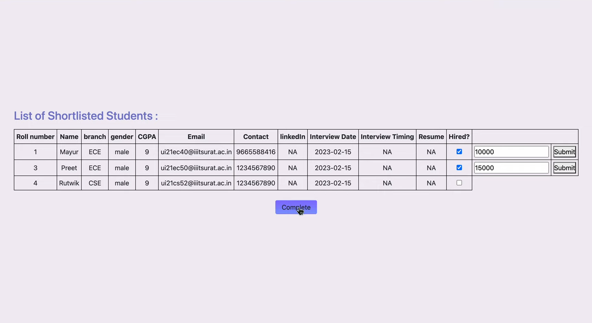
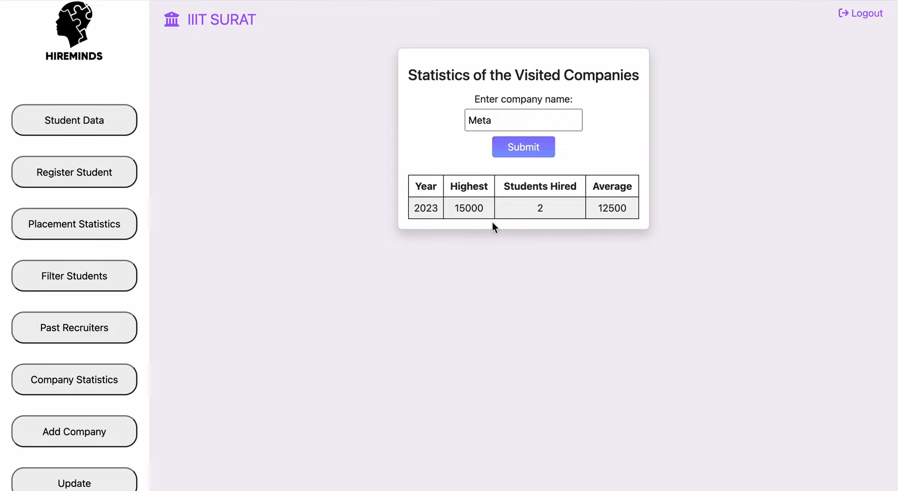
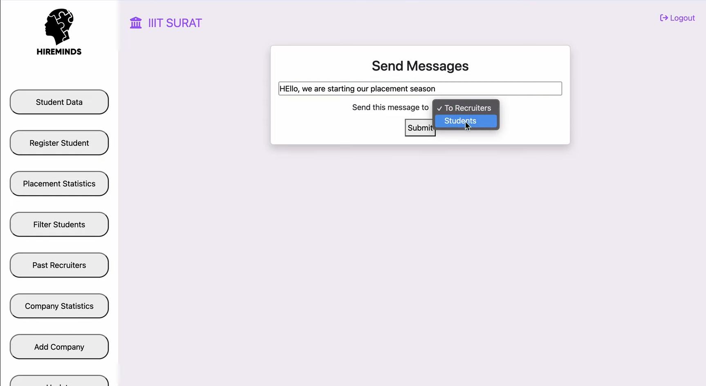

# HireMinds 
<p align="center">  </p> 

```
One stop solution for students, companies and TnP cells to streamline the hectic placement process.
```


# Overview
<br>
<br>
<p align="center">

</p>

<p align="center">

</p>


## `Students Data`

```
TnP cell can register students & update their details as per the need arises and one can view students on the basis of filtering.
```
<br>
<br>
<p align="center">

</p>

## `Company Addition`

```
Companies can be easily registered when they visit the campus.
```
<p align="center">

</p>

## `Interview Scheduling`

```
Companies can furthermore apply filtering as per their requirements.
```
<p align="center">

</p>


```
Out of all the filtered students, the interviews could be scheduled. 
```

<p align="center">

</p>

```
The shortlisted students are being offered a CTC. 
```

<p align="center">

</p>

## `Statistics`

```
 • One can view the CTC offered by the companies in a given year.
 • Apart from the company specific data, the traditional placements stats are also available.
```
<p align="center">

</p>

## `Broadcast`

```
A message can be broadcast with a single click to both the students & companies to let them know that the season has begun. 
```
<p align="center">

</p>

<br>

### Technologies Used  
<div align="center">  
<a target="_blank"></a> 
<a href="https://en.wikipedia.org/wiki/HTML5" target="_blank"></a>  
<a href="https://www.w3schools.com/css/" target="_blank"></a>  
<a href="https://www.w3schools.com/css/" target="_blank"></a>  
</div>

